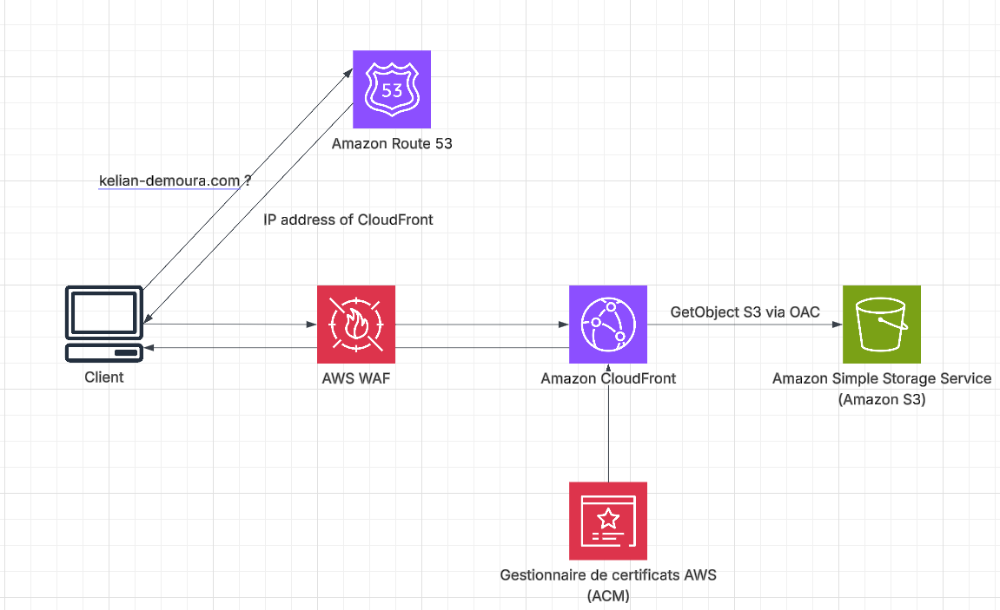

# Cloud Security Portfolio: AWS Infrastructure

[](https://kelian-demoura.com)
[](https://aws.amazon.com/)
[](https://github.com/Kelian-DeMoura)
[](https://www.linkedin.com/in/kelian-de-moura)

The source code and cloud infrastructure documentation for my personal portfolio website: kelian-demoura.com.

I am Kelian De Moura, a Computer Engineering Apprentice at Exxelia and CESI Nancy, currently working toward a Cloud Security Engineer position. This repository serves as a practical demonstration of my ability to design, deploy, and secure a production-ready web application on AWS.

## Tech Stack

[](https://aws.amazon.com/s3/)
[](https://aws.amazon.com/cloudfront/)
[](https://aws.amazon.com/waf/)
[](https://aws.amazon.com/route53/)
[](https://aws.amazon.com/certificate-manager/)
[](https://github.com/features/actions)
[](https://www.terraform.io/)

## Table of Contents

* [Overview](#overview)
* [Architecture](#architecture)
* [Implementation](#implementation)
  * [1. Storage and Data Security (Amazon S3)](#1-storage-and-data-security-amazon-s3)
  * [2. Global Delivery and Perimeter Security (Amazon CloudFront & WAF)](#2-global-delivery-and-perimeter-security-amazon-cloudfront--waf)
  * [3. DNS Routing (Amazon Route 53)](#3-dns-routing-amazon-route-53)
* [Outcome](#outcome)
* [Next Steps](#next-steps)
  * [Secure CI/CD Pipeline (GitHub Actions)](#secure-cicd-pipeline-github-actions)
  * [Infrastructure as Code (Terraform)](#infrastructure-as-code-terraform)

## Overview

Beyond hosting a static single-page application, the infrastructure itself acts as a proof of concept for cloud engineering capabilities, requiring enterprise-grade security, high availability, and automated deployments. The objective was to design a serverless AWS architecture that meets strict security standards while remaining cost-effective:

* Ensure zero direct public access to the storage backend.
* Enforce encryption at rest and in transit without inflating monthly costs.
* Protect the application against common web vulnerabilities.
* Automate the deployment process, without storing long-lived AWS credentials in third-party services (planned, see Next Steps).
* Support Single Page Application (SPA) routing natively in the cloud.

## Architecture



## Implementation

### 1. Storage and Data Security (Amazon S3)
The first requirement was a durable, encrypted backend with rollback protection for the static assets, with zero direct exposure to the internet. The bucket had to be reachable only through the CDN layer described below, never through a public S3 URL or a static website hosting endpoint. To meet this, I provisioned an Amazon S3 bucket (aws-portfolio-kelian) and hardened it as follows:

* **Cost-Optimized Encryption:** I enabled Server-Side Encryption with Amazon S3 managed keys (SSE-S3) so every object is encrypted at rest by default. While KMS provides granular per-key access control and audit logging via CloudTrail, I specifically avoided it here to reduce baseline costs (KMS bills per API call), opting for SSE-S3 which still meets the encryption-at-rest requirement for a static-asset use case. SSE-C, which would require the client to manage and transmit its own encryption keys, was explicitly ruled out as unnecessary complexity for public static content.
* **Data Integrity:** Enabled bucket versioning to protect against accidental overwrites or deletions and to allow instant rollbacks to a previous version of any object.
* **Access Control:** Enabled "Block all public access" at the bucket level so the bucket has no public endpoint and is invisible to direct internet access, closing off the most common S3 misconfiguration (an openly readable/writable bucket). Read access is strictly delegated to the CloudFront distribution via Origin Access Control (OAC), which signs every request with SigV4 so S3 can verify it genuinely originates from that specific distribution. The bucket policy enforces this by scoping `s3:GetObject` to the CloudFront service principal and further constraining it with an `AWS:SourceArn` condition, so no other CloudFront distribution or caller (not even one in my own AWS account) can read the objects:

```json
{
    "Version": "2008-10-17",
    "Id": "PolicyForCloudFrontPrivateContent",
    "Statement": [
        {
            "Sid": "AllowCloudFrontServicePrincipal",
            "Effect": "Allow",
            "Principal": {
                "Service": "cloudfront.amazonaws.com"
            },
            "Action": "s3:GetObject",
            "Resource": "arn:aws:s3:::aws-portfolio-kelian/*",
            "Condition": {
                "ArnLike": {
                    "AWS:SourceArn": "arn:aws:cloudfront::992685484106:distribution/E3ROK01SJ5VP2A"
                }
            }
        }
    ]
}
```

### 2. Global Delivery and Perimeter Security (Amazon CloudFront & WAF)
Since the S3 bucket has "Block all public access" enabled and no static website hosting endpoint, the origin cannot serve traffic directly to the internet. I needed a CDN in front of it that could both terminate HTTPS with a custom domain and authenticate securely against the private bucket, without adding latency or ongoing operational overhead. I deployed a CloudFront distribution using all Edge Locations for maximum global performance and configured it as follows:

* **Origin Authentication:** Set the S3 bucket as the origin using Origin Access Control (OAC), which signs every request from CloudFront to S3. This lets CloudFront alone read the objects (via the bucket policy shown above) while the bucket itself remains fully private, closing off any direct-to-origin access path.
* **Transport Security:** Attached a custom ACM certificate for kelian-demoura.com (issued in us-east-1, the only region CloudFront accepts certificates from). I configured the Viewer Protocol Policy to Redirect HTTP to HTTPS and restricted the Security Policy to TLSv1.2_2021 to prevent protocol downgrade attacks and enforce modern cipher suites.
* **Caching and Routing:** Applied the Managed-CachingOptimized policy to reduce origin requests and lower latency. Because the site is a Single Page Application, the router handles paths client-side, so a direct hit on any route other than `/` (e.g. a refresh on /projects) doesn't exist as an object in S3 and would normally return a 403/404. I configured custom error responses so that 403 (Forbidden) and 404 (Not Found) errors are intercepted and return /index.html with a 200 HTTP status code, letting the client-side router take over and ensuring seamless SPA routing. The Default Root Object was set to index.html.
* **Threat Protection:** Integrated AWS WAF at the Edge with the Core Rule Set (Core Protections) enabled in monitor mode, giving visibility into common web exploits (SQLi, XSS, bad bots) targeting the distribution before deciding whether to move specific rules to block mode.

### 3. DNS Routing (Amazon Route 53)
I registered a public Hosted Zone in Route 53 for the .com TLD, with kelian-demoura.com as the apex (zone/root) domain. My goal was to point this apex directly at the CloudFront distribution, but the CDN only exposes a dynamic AWS-generated domain name (e.g. `d123456abcdef8.cloudfront.net`) instead of a static IP.

A standard CNAME record cannot be used on an apex/zone-apex record: the DNS specification (RFC 1034/1035) forbids coexisting a CNAME with other record types on the same name, which would hide the mandatory NS (Name Server) and SOA (Start of Authority) records, and would break MX (mail) resolution at the root of the domain.

To solve this, I used a Route 53-specific feature: an **Alias record of type A** targeting the CloudFront distribution. Instead of storing a fixed IP, the Alias record is resolved internally by Route 53, which performs **DNS flattening (CNAME flattening)**. At query time, Route 53 transparently resolves the CloudFront domain name to its current IP address(es) and returns that IP directly to the client in a single response. This gives the effect of a CNAME (always pointing to CloudFront's live endpoint, even if its underlying IPs change) while remaining a valid A record at the zone apex, so the NS, SOA, and MX records coexisting on kelian-demoura.com are fully preserved. Alias queries to AWS targets are also free of charge and resolve with lower latency than a standard CNAME lookup.

## Outcome

The resulting infrastructure is a highly resilient, cost-optimized, and secure platform. The application is delivered with low latency globally, protected by WAF and strict IAM policies.

## Next Steps

The infrastructure above was provisioned manually through the AWS Console to iterate quickly on the design. The two items below are designed but not yet implemented.

### Secure CI/CD Pipeline (GitHub Actions)
Storing long-lived AWS access keys as GitHub secrets is ruled out: a leaked repo, a compromised dependency, or a misconfigured secret would give an attacker permanent AWS access until the key is manually revoked. Instead, the deployment pipeline will use GitHub Actions with OpenID Connect (OIDC), so no AWS credential ever lives in GitHub.

* **Identity federation instead of stored secrets:** On each run, GitHub issues a short-lived signed JWT unique to that workflow execution, containing verifiable claims about the source (repository, branch, event). An OIDC identity provider registered in AWS IAM trusts GitHub as a token issuer. The pipeline exchanges this JWT for temporary AWS credentials (valid ~1 hour) via `sts:AssumeRoleWithWebIdentity`, so there is nothing static to leak and nothing to rotate.
* **Least-privilege trust and permissions:** The IAM role's trust policy will restrict which JWTs it accepts to a `StringLike` condition on the `sub` claim, scoped to this exact repository and the `main` branch only, so no other GitHub repository can assume it. The role's permissions policy will be scoped to exactly two actions: `s3:PutObject`/`GetObject`/`DeleteObject`/`ListBucket` on the portfolio bucket, and `cloudfront:CreateInvalidation` on this specific distribution.
* **Deployment steps:** On every push to the main branch, the workflow will execute `aws s3 sync` with the `--delete` flag to ensure parity between the repository and the bucket (versioning in S3 protects against mistakes here), followed immediately by a CloudFront cache invalidation (`create-invalidation --paths "/*"`) so edge locations fetch the latest content instead of serving stale cached files.

### Infrastructure as Code (Terraform)
The next iteration is to migrate the stack to Terraform so S3, CloudFront, WAF, Route 53, ACM, the OIDC provider, and the IAM role are all defined as code, version-controlled, and reproducible:

* Import the existing resources into Terraform state (`terraform import`) instead of recreating them, to avoid any downtime on the live site.
* Split the configuration into reusable modules (storage, delivery, dns, ci-cd) so the same stack could be redeployed under a different domain.
* Run `terraform plan` as a required check in the GitHub Actions pipeline before any `apply`, so infrastructure changes go through the same review process as application code.
* Store the Terraform state in a remote backend (S3 with a DynamoDB lock table) rather than locally, to support safe collaboration and prevent state corruption.
